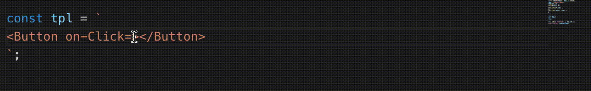

<p>
  <h1 align="center">Regular Tool</h1>
</p>

Regular插件工具

## Features
- Syntax-highlighting
- Snippets
- Auto Completion

## Syntax-highlighting

* 支持后缀为.rgl文件的语法高亮
* 支持内联模板的高亮，不过需要符合特定的格式：

  ```js
  // 以 `tpl = ` 起始的，其后的 template string 将会应用 regular 模板的高亮 
  tpl = `template content`
  ```

## Snippets

| 语法  | 生成内容 | 效果 |
| -------: | ------- | ---- |
| `rglc→`   | regular component skeleton | 略 
| `list→`   | regular list | {#list}
| `if→`  | regular if | {#if}
| `ifelse→`  | regular if else | {#if} {#else} {/if}
| `ifelseif→`  | regular if else if | {#if} {#elseif} {/if}
| `include→`  | regular include statement | {#include}
| `update→`  | regular update | this.$update()
| `watch→`  | regular watch | this.$watch()
| `emit→`  | regular emit | this.$emit()

## Auto completion
- 支持js文件内使用`this.`进行方法的补全操作  


## Requirements

### ✅ 开启字符串补全
由于regular的模板是基于字符串的，因此大部分的补全在字符串内执行。  
需要在设置(`User Setting`)中：
```
"editor.quickSuggestions": {
    "other": true,
    "comments": false,
    "strings": true
}
```
打开对`strings`补全的支持。

### ✅ 模板文件补全支持  
由于vscode内置语言中不支持`tpl`为后缀作为language，因此需要用户自定义关联`tpl`为`html`。  
需要在设置(`User Setting`)中：
```
"files.associations": {
    "*.tpl": "html"
}
```
配置`tpl`后缀文件到`html`的关联

**Enjoy!**
